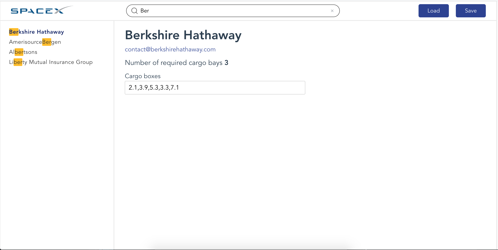

# SpaceX Cargo Planner (react)

This app is for shipment cargo space calculating. It loads part of S&P500 companies from external source (if local copy is not present). Calculates the needed cargo bays count for selected shipment.

User can search company in the list, edit shipments slot data, save shipments list to local storage of browser, load shipment companies.



## TODO

- ~~MVP (functional components only)~~
- ~~BEM features~~
- ~~Redux~~
- ~~search shipments by title~~
- ~~cargo boxes logic~~
- ~~routes~~
- ~~SCSS support~~
- ~~preloaders, toasts, input clear~~
- ~~refactor and code cleanup~~
- ~~styling (exclude prefixes)~~
- ~~responsive~~
- ~~test production build~~
- ~~update README~~

## Project setup

```
git clone git@bitbucket.org:Refleckt/spacex-cargo-planner-react.git
cd spacex-cargo-planner-react
```

```
yarn install
```

### For development env

```
yarn start
```

### For production build

```
yarn build
```

To run on static server use:

```
yarn global add serve
serve -s build
```
